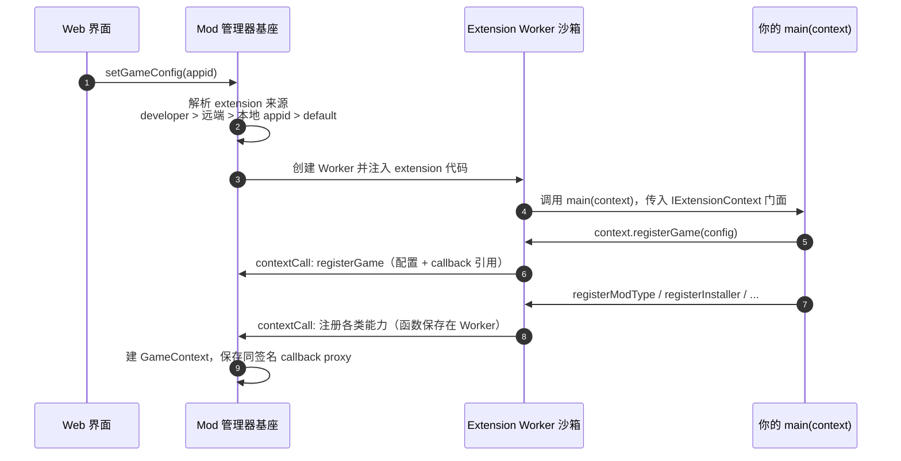
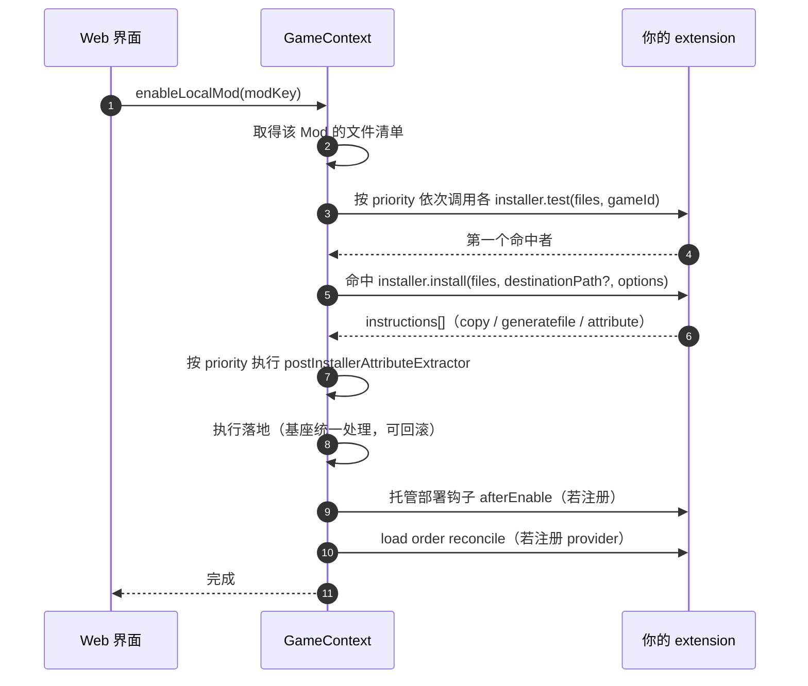
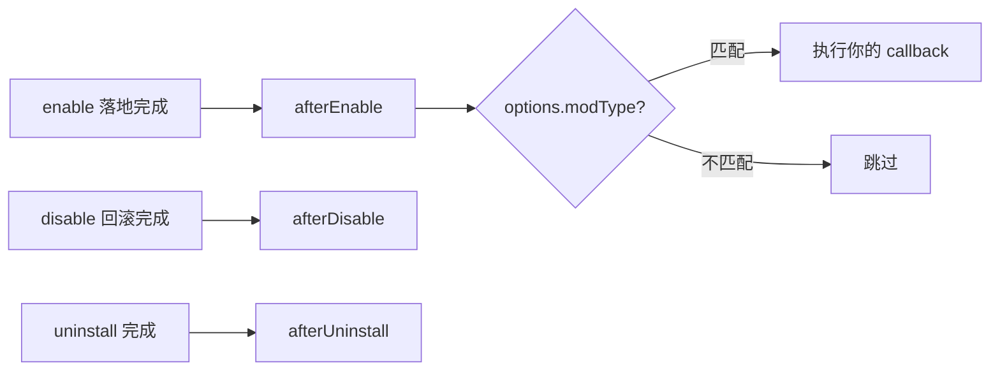
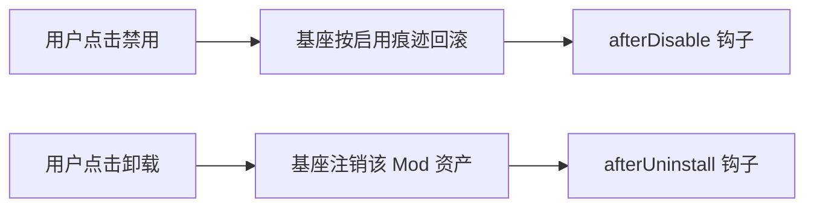
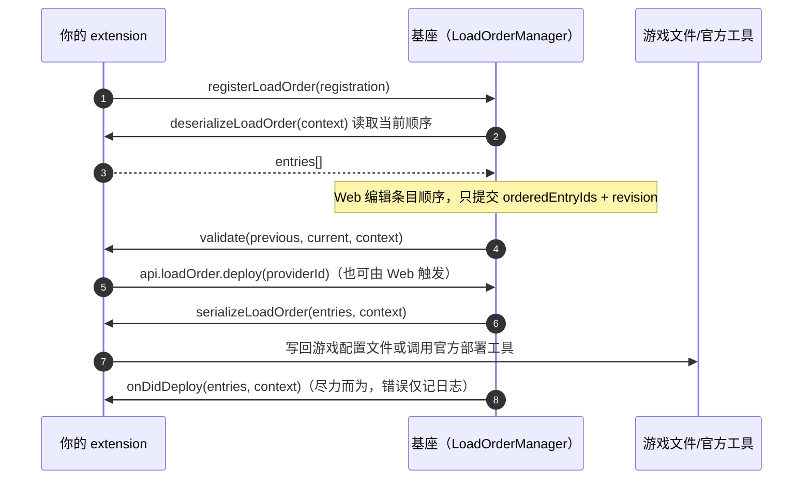

# 扩展运行时序

extension 开发者需要理解两条时间线：**扩展自身的加载与注册**，以及 **用户操作 Mod 时基座如何调用你的函数**。

## 一、扩展加载与注册

游戏页面打开或触发 Mod 相关操作时，基座为当前 `appid` 解析并加载 extension：

关键点：

- 找不到专用 extension 时回退到 `default`；`default` 里 `game.id` 写 `'default'` 也会被绑定到真实 `appid`。
- **函数体始终留在 Worker 里**。基座只保存同签名 proxy，后续调用会 RPC 回 Worker 执行真实函数。
- 因此注册时的 `test`、`install`、`isSupported`、回调都是你的闭包，可以自由引用模块内状态。

## 二、安装与启用（enable）

下载完成的压缩包先由基座建档，启用时才进入 extension 逻辑：

::: tip enable 的语义
`installer.install` 产出的只是「施工图纸」（instructions），真正的文件落地由基座统一执行并记账，
首次覆盖的原文件会被保留以便回滚。installer 本身不直接写游戏目录。
:::

### installer 与 deploymentOptions

启用时基座会向 `install` 注入 [DeploymentOptions](/reference/types/installer#deploymentoptions)：

| 字段 | 用途 |
| --- | --- |
| defaultPathBySource | default 扩展的默认落点（相对游戏根目录） |
| ignoreConflict | Web 侧「忽略冲突并继续」，跳过冲突预检直接覆盖 |
| sourcePathByFile | 压缩包内路径 → 物理路径映射（基座注入） |
| fomod | FOMOD 部署上下文，storedState 由基座注入 |

### post-installer 属性抽取

[registerPostInstallerAttributeExtractor](/reference/context/registerPostInstallerAttributeExtractor)
在 installer 返回、落地执行**之前**运行，用于从最终选中的文件集合里产出 Mod 属性
（典型场景：FOMOD 选出的 pak 列表）。约束：

- 按 priority 降序执行；同一 key 先声明者占有。
- 返回值必须是 JSON 兼容值；`fomod` / `heyboxModType` 是保留字段。
- 必须**确定性与无副作用**：可以读 `stagingPath` 下的暂存文件，但不能写游戏文件、不能弹 UI。

## 三、托管部署钩子

[registerManagedDeploymentHook](/reference/context/registerManagedDeploymentHook) 在托管部署
变更的生命周期节点触发：

用途举例：Palworld / Helldivers2 用 `afterEnable` 重新生成入口文件。回调失败会中断对应阶段，
要谨慎处理。

## 四、禁用与卸载

- **disable 不再调用 extension 的 installer**：回滚依据 enable 阶段留下的部署痕迹。
- disable 不销毁资产（保留审计与再次启用），uninstall 才注销资产并释放占用。

## 五、加载顺序（Load Order）

与 enable/disable 不同，Load Order 是扩展声明、基座编排的一条**独立链路**，
面向全部已注册 Mod（含未启用/已禁用）：

要点：

- `LoadOrderEntry.id` 必须稳定且在 provider 内唯一；`data` 是 extension 私有，不会发给 Web。
- 生命周期变化（启用/禁用/卸载）会触发基座的 reconcile，重新走 deserialize → serialize。
- `validate` 只做游戏领域校验；通用 ID 完整性与 revision 已由基座校验。

## 下一步

- 每个注册函数的参数与流程：[扩展门面 context](/reference/context/registerGame)
- 宿主能力用法：[工具面 API](/reference/api/events)
