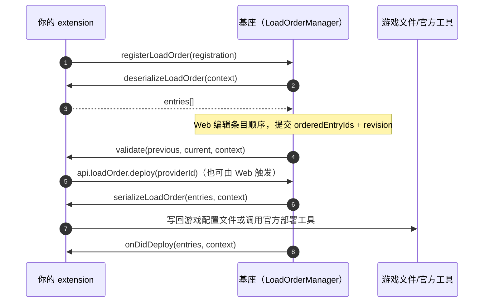

# registerLoadOrder

> 为指定游戏注册加载顺序 provider：把「全部已注册 Mod 的清单」反序列化为游戏领域条目，
> 再把用户调整后的顺序序列化回游戏。

## 签名

```ts
registerLoadOrder(options: LoadOrderRegistration): void
```

## 参数

| 参数 | 类型 | 说明 |
| --- | --- | --- |
| options | [LoadOrderRegistration](/reference/types/load-order#loadorderregistration) | provider 注册配置 |

`LoadOrderRegistration` 关键字段：

| 字段 | 类型 | 说明 |
| --- | --- | --- |
| id | `string` | provider 唯一标识 |
| gameId | `number \| string` | 归属游戏 |
| title | `string` | UI 展示标题 |
| usageInstructions | `string \| string[]` | 顺序说明文案 |
| modTypes | `string[]` | 该 provider 负责的 modType |
| isModRelevant | 函数 | 判断某 Mod 是否参与此顺序 |
| deserializeLoadOrder | 函数 | 从游戏文件/配置读出当前顺序 → 条目列表 |
| validate | 函数 | 校验用户调整后的顺序，失败应抛错 |
| serializeLoadOrder | 函数 | 把最终顺序写回游戏 |
| onDidDeploy | 函数 | 部署成功后的尽力而为回调 |

## 返回值

无。

## 运行流程



要点：

- 生命周期变化（启用/禁用/卸载）会触发基座的 reconcile，自动重新走 deserialize → serialize。
- `validate` 只做游戏领域校验；通用 ID 完整性与 revision 已由基座校验。
- 条目 `data` 是扩展私有字段，不会发给 Web。

## 意义

把「加载顺序」这个游戏领域概念交给扩展实现，基座只负责清单、revision、串行队列与持久化。
顺序管理独立于单 Mod 的启用/禁用：即使 Mod 被禁用，其条目仍保留原位，重新启用后顺序不丢。

## 应用场景

- **pak 加载顺序**（BlackMythWukong）：`deserialize` 读游戏目录的 pak 列表，`serialize` 写回。
- **BepInEx / MelonLoader 插件顺序**：读写游戏配置文件的顺序字段。
- **REDmod 部署顺序**（Cyberpunk2077）：serialize 调用官方部署工具。

## 相关类型

- [LoadOrderRegistration](/reference/types/load-order#loadorderregistration)
- [LoadOrderContext](/reference/types/load-order#loadordercontext)
- [LoadOrderEntry](/reference/types/load-order#loadorderentry)
- [LoadOrderSnapshot](/reference/types/load-order#loadordersnapshot)
- 部署入口：[api.loadOrder.deploy](/reference/api/vfs-loadorder#loadorder-deploy)
