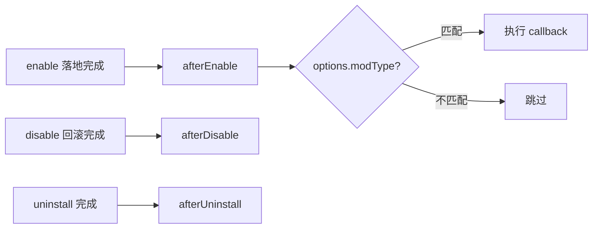

# registerManagedDeploymentHook

> 托管部署生命周期钩子：在 Mod 启用 / 禁用 / 卸载的关键节点触发，用于同步派生文件。

## 签名

```ts
registerManagedDeploymentHook(
  phase: ManagedDeploymentHookPhase,
  options: { modType?: string },
  callback: (payload: Record<string, unknown>) => unknown | Promise<unknown>,
): void
```

## 参数

| 参数 | 类型 | 说明 |
| --- | --- | --- |
| phase | [ManagedDeploymentHookPhase](/reference/types/vfs#manageddeploymenthookphase) | `'afterEnable' \| 'afterDisable' \| 'afterUninstall'` |
| options | `{ modType?: string }` | 可选；指定后只处理匹配的 modType |
| callback | `(payload) => unknown \| Promise<unknown>` | 钩子回调，payload 由基座注入 |

## 返回值

无。

## 运行流程



1. 对应阶段完成后，基座按注册顺序执行匹配的 callback。
2. 回调返回 Promise 时基座等待其完成。
3. 回调抛错会中断当前阶段并向上反馈。

## 意义

给扩展一个「落地之后」的确定性时机：很多 Mod 需要在文件落地后重新生成入口、重建索引、刷新派生文件，且必须在禁用/卸载时对称清理。

## 应用场景

- **重建入口文件**：如 Palworld / Helldivers2 在 `afterEnable` 重新生成加载器入口。
- **对账清理**：`afterDisable` / `afterUninstall` 时删除该 Mod 的派生缓存。

## 相关类型

- [ManagedDeploymentHookPhase](/reference/types/vfs#manageddeploymenthookphase)
