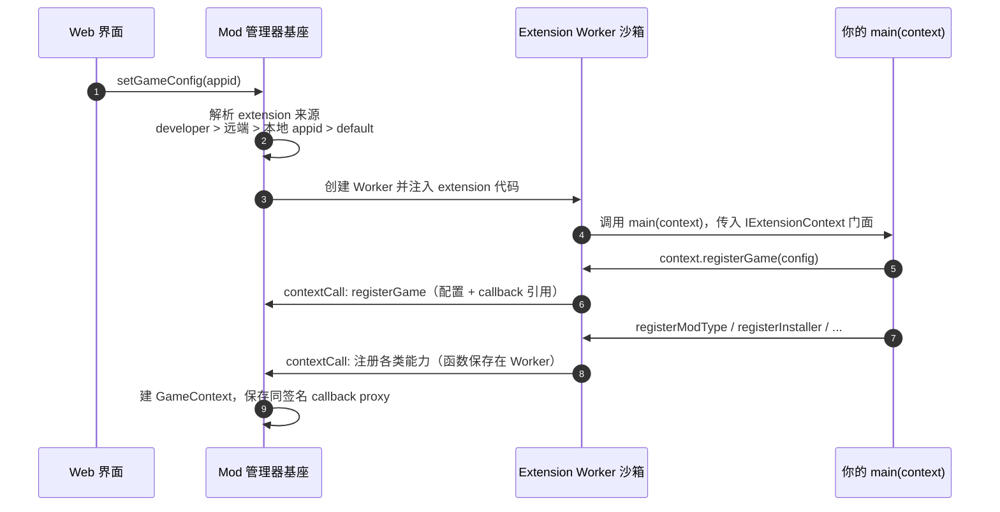

# 扩展沙箱与加载模型

> 目标：扩展在 Worker 沙箱中执行，扩展代码不能危及宿主进程。
> 本文行为以 SDK `extensionManager.ts` / `extensionSandboxManager.ts` 为准。

## 一、加载顺序

游戏页面打开或触发 Mod 操作时，基座为当前 `appid` 解析 extension，优先级从高到低：

1. 用户设置里的 developer extension 路径（本地开发）
2. 远端 extension 配置
3. 本地 `extensions/${appid}.cjs`
4. 以上不存在或加载失败时回退到 `extensions/default.cjs`

回退到 default 时，`default` 的 `game.id` 即使写 `'default'`，也会被绑定到当前加载的 `appid`。
非 default extension 加载失败会 fallback 到 default；default 也失败才向上返回失败。



## 二、沙箱边界

Worker runtime 会限制常见 Node 能力：

- `globalThis.process`、`globalThis.require`、`globalThis.module`、`globalThis.exports` 被隐藏。
- 内部 CommonJS `require` 只允许白名单模块（目前仅 `path`）。
- `fs`、`child_process`、`electron`、`module` 等不会暴露。
- Worker 内 `console.log/warn/error` 会被转发到宿主日志。

注意：Worker 线程不是强安全边界。当前方案重点是受控 API 面；extension 只能通过
`IExtensionContext` 门面与基座交互。

## 三、注册协议（contextCall）

`registerGame`、`registerModType`、`registerInstaller`、`registerAction` 等注册函数不是普通
「调用主线程能力」，而是「把 extension 自己的能力登记给主线程」：

1. extension 在 Worker 内调用注册函数。
2. Worker 把可序列化配置发给主线程，函数保存在 Worker 的 callback store，只给主线程一个 callback ref。
3. 主线程注册同签名 proxy。
4. 后续主线程调用 tester/installer/action 时，proxy 再 RPC 回 Worker 执行真实函数。

因此注册的函数体始终留在 Worker 里，可以自由引用模块内状态。注意：

- callback proxy 默认超时 10 分钟。
- Worker 崩溃会 reject 当前 pending callback。
- generation 或 appid 不匹配的迟到消息会被忽略。
- 普通对象里的内部字段 `__sandboxCallbackRef` 会被序列化器丢弃，extension 无法伪造 callback ref。

## 四、API Proxy

`context.api` 使用通用 RPC Proxy：运行时记录属性访问路径，调用时发给主线程解析。例如：

```ts
await context.api.util.GameStoreHelper.findByAppId(appid)
// 等价 RPC 路径：['util', 'GameStoreHelper', 'findByAppId']
```

- 主线程通过白名单解析路径，extension 只能调用白名单中最终为函数的节点。
- 禁止路径片段：`__proto__`、`prototype`、`constructor`。
- Proxy 表示远程能力引用，不表示本地数据对象：`{ ...context.api.util }`、`Object.keys(...)`、
  `JSON.stringify(...)` 均不支持。

## 五、本地工具 vs 远程调用

大部分 `context.api` 方法走异步 RPC。少量纯同步工具在 Worker 本地实现：

- `api.util.path`（Node path 封装）、`api.util.sanitizeFilename`、`api.util.pathPattern`
- `api.events` / `api.emitAndAwait` / `api.onAsync`（扩展沙箱内的事件总线）
- `api.util.fomod.resolveFileDependencies`（解析当前 extension bundle 内的文件依赖）

其余（GameStoreHelper、steam、ui、fomod.requestStep/closeSession、fs、archive、fileParseApi、
vfs、loadOrder）都通过主线程 broker 执行。

## 六、开发者约束

推荐：

```ts
const helper = context.api.util.GameStoreHelper
const game = await helper.findByAppId(appid)
```

避免：

```ts
const helper = { ...context.api.util.GameStoreHelper }  // 不支持
await context.api.fs.readFile('/tmp/a')                 // 不在白名单，不支持
```

所有需要主线程状态、文件系统、下载、VFS、Electron 的能力，都必须先设计成受控 API 再加入白名单。
