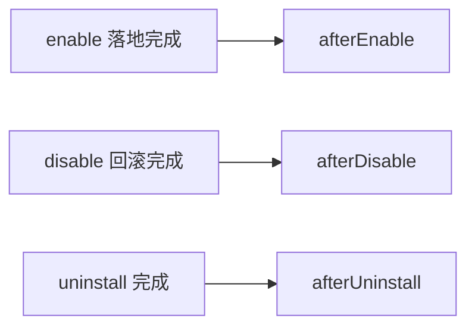

# Disable 与 Uninstall

> 关键差异：**disable 不调用 extension**，只按 enable 阶段留下的部署痕迹回滚；
> **uninstall** 才注销资产并释放占用。

## 触发阶段与钩子

`registerManagedDeploymentHook(phase, { modType? }, callback)` 在以上节点触发；`modType`
可限定只处理指定类型。回调失败会中断对应阶段。

## disable 语义

1. 依据该 mod 的部署痕迹（enable 阶段记录的落地清单）逐目标路径回滚。
2. 针对每个目标位置：
   - **未部署过**：跳过。
   - **被其他 Mod 覆盖**：只摘除本 Mod 的记录，不动物理文件。
   - **由本 Mod 持有**：恢复上一层状态（其他 Mod 或原版文件）；无上一层时移除目标文件。
3. 部署痕迹不清空：保留用于审计、后续删除流程与再次启用。

## uninstall 语义

1. 释放该 Mod 占用的资产（未被其他 Mod 引用的资产才会被物理删除）。
2. 注销该 Mod 的注册条目。
3. 清理残留的部署记录。

## 生命周期小结

| 阶段 | 扩展参与 | 资产状态 |
| --- | --- | --- |
| enable | installer.test / install、post-installer 抽取、afterEnable 钩子 | 落地 + 记账 |
| disable | 仅 afterDisable 钩子（installer 不再调用） | 回滚，资产保留 |
| uninstall | 仅 afterUninstall 钩子 | 注销条目，释放资产 |
