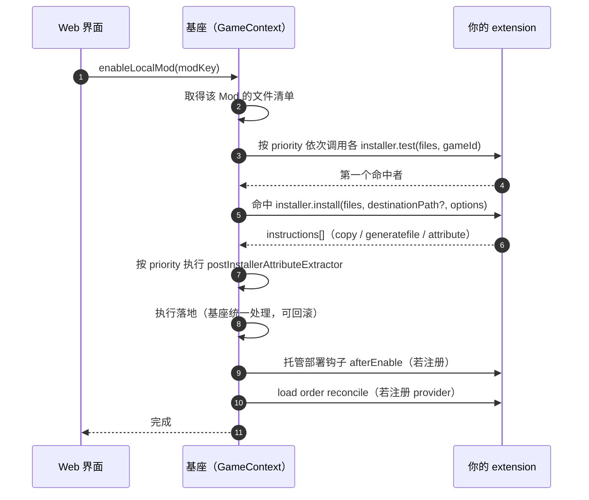

# Enable 时序

> 术语说明：**install** 是历史命名，容易与「ingest 建档索引」混淆；
> **enable** 是推荐用词，表示「将 Mod 部署到游戏目录并生效」。

## 核心定位

`enableLocalMod` 是 Extension（沙箱逻辑）与基座执行层之间的桥梁：取得文件清单，
交给 Extension 判定与生成指令，最后把指令交回基座统一落地。

架构铁律：

1. 基座负责协调与落地，extension 只产出指令。
2. 指令序列只作为局部变量流转，extension 不直接写游戏目录。

## 流转

## 各阶段细节

### 1. 获取文件清单

基座从已建档的 Mod 数据中取出压缩包内相对路径列表，组装上下文。

### 2. 匹配 tester

按 priority 遍历已注册 ModType 的 tester；都未命中时抛「未知的 Mod 格式」异常。

### 3. 生成部署指令

命中规则的 installer 生成 `instructions`。当前支持 `copy` / `generatefile` / `attribute`。

### 4. 基座执行

- 指令交给基座统一落地：`copy` 按源文件落地，`generatefile` 生成新文件，
  `attribute` 写入元数据。
- 首次覆盖的目标位置会保留原文件，保证禁用/回滚可恢复。
- 落地与记账完成后保存部署痕迹，供 disable 阶段使用。

## 冲突预检

Web 侧「忽略冲突并继续」通过 `DeploymentOptions.ignoreConflict` 跳过启用前冲突预检，
直接覆盖落地。基座对冲突预览、直接启用、静默 FOMOD 复用、FOMOD 重配置运行同一套
属性抽取阶段，预览与启用不会观察到不同的选择结果。
