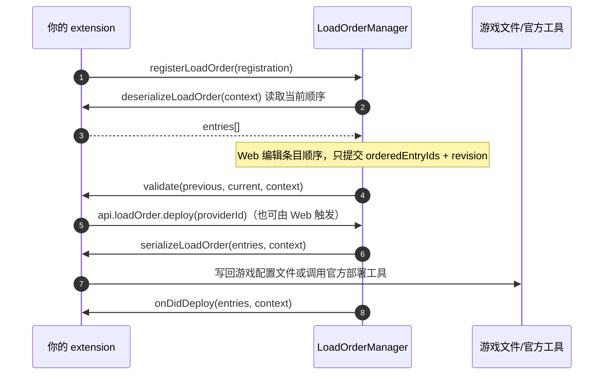

# 加载顺序 Load Order

> Load Order 是扩展声明、SDK 编排、VFS 持久化、Web 编辑的一条**独立链路**，
> 管理一个游戏级聚合顺序，不替代单个 Mod 的启用、禁用或托管部署 mutation。

## 职责边界

- **VFS** 提供全部 `registeredMods` 的 inventory。一个注册 Mod 对应一个 snapshot，含未启用和已禁用的
  Mod；不会按文件展开。
- **Extension** 将 inventory 反序列化成游戏领域条目，校验用户顺序，并把最终顺序序列化到游戏需要的文件或工具。
- **SDK** 负责 provider 注册、revision 校验、串行队列、状态持久化、生命周期 reconcile、失败状态与事件。
- **Web** 只接收展示字段，只提交 `orderedEntryIds + revision`，不能读取或修改 extension 的私有 `data`。

## 注册

```ts
context.registerLoadOrder({
  id: 'example',
  gameId: 1091500,
  title: 'Load Order',
  usageInstructions: ['越靠前优先级越高'],
  modTypes: ['example-type'],
  deserializeLoadOrder(context) {
    return context.mods.map((mod) => ({
      id: mod.modKey,
      ownerModKey: mod.modKey,
      name: String(mod.metaInfo.name || mod.modKey),
      enabled: mod.enabled,
      data: { internalValue: mod.modKey },
    }))
  },
  validate(previous, current, context) {
    // 可选的游戏领域校验。通用 ID 完整性和 revision 已由 SDK 校验。
  },
  async serializeLoadOrder(current, context) {
    // 写入游戏配置或调用官方部署工具。
  },
})
```

保留的 extension action 可以调用 `context.api.loadOrder.deploy(providerId)` 进入同一串行部署队列。
不要直接绕过 SDK 重复调用游戏工具。

## 类型契约

```ts
interface LoadOrderRegistration {
  id: string                          // provider 唯一标识
  gameId: number | string
  title: string
  usageInstructions?: string | string[]
  modTypes: string[]                  // 该 provider 负责的 modType
  isModRelevant?(mod: LoadOrderModSnapshot): boolean | Promise<boolean>
  deserializeLoadOrder(context: LoadOrderContext): LoadOrderEntry[] | Promise<LoadOrderEntry[]>
  validate?(previous, current, context): void | Promise<void>
  serializeLoadOrder(entries: LoadOrderEntry[], context: LoadOrderContext): void | Promise<void>
  onDidDeploy?(entries: LoadOrderEntry[], context: LoadOrderContext): void | Promise<void>
}

interface LoadOrderContext {
  appid: number
  gameId: number
  gamePath: string
  revision: number          // 乐观锁修订号
  reason: LoadOrderReason   // open / refresh / user-save / manual-deploy / after-enable ...
  savedOrder: string[]
  mods: LoadOrderModSnapshot[]
}

interface LoadOrderEntry {
  id: string                // 稳定且在 provider 内唯一
  ownerModKey: string
  name: string
  enabled: boolean
  data?: Record<string, unknown>  // 扩展私有，不会发给 Web
}
```

## 语义要点

- `mods` 中的 `enabled` 沿用 VFS 语义：该 Mod 当前至少存在一个 `appliedFile`。
  禁用条目仍应由 extension 返回，用户禁用再启用后可保留原位置。
- `validate` 只做游戏领域校验；通用 ID 完整性与 revision 已由 SDK 校验。
- `data` 只能包含 JSON 可序列化内容，且不会发送到 Web。

## 部署流程



## Post-deploy 回调

`onDidDeploy(entries, context)` 只在游戏部署成功之后执行，用于尽力而为的副作用：

- SDK 在持久化 `deploymentStatus: clean` 并发出 clean 状态事件后调用。
- 回调在 provider 队列内执行，不会与另一次部署重叠。
- 回调错误仅记日志，不改变 clean 状态、不回滚 VFS、不把已完成的部署转为失败。

## 快照

`loadOrder.deploy` 返回 `LoadOrderSnapshot`：

```ts
interface LoadOrderSnapshot {
  supported: boolean
  providers: LoadOrderProviderSummary[]
  providerId?: string
  revision: number
  entries: LoadOrderUiEntry[]
  deploymentStatus: 'clean' | 'dirty' | 'deploying' | 'failed'
  appliedRevision?: number
  lastError?: LoadOrderPersistedError
}
```
